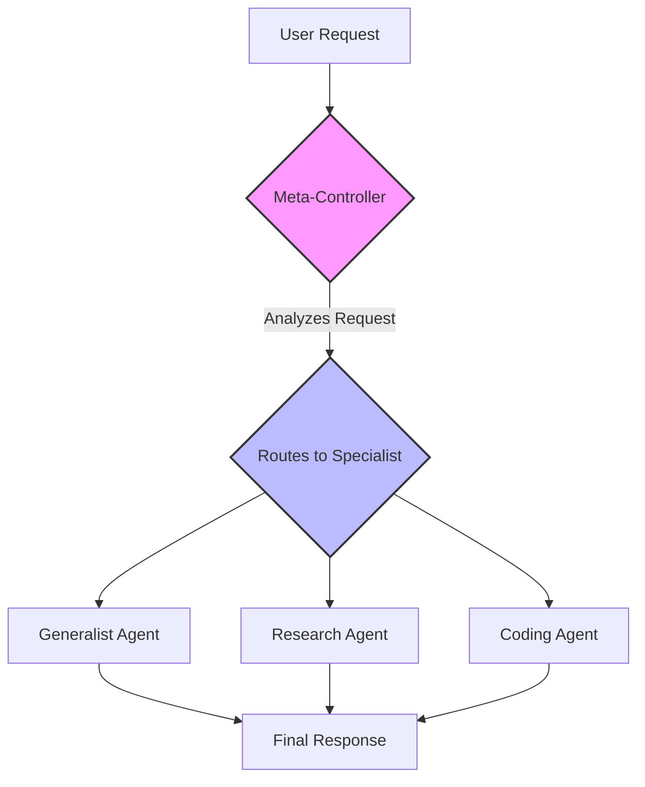

# 所有AI代理架构

     [](https://opensource.org/licenses/MIT)

欢迎来到**现代AI代理设计**的全面实践大师课程。这个仓库包含了**17+种最先进的代理架构**的详细实现，使用LangChain和LangGraph构建。它旨在成为一本活体教科书，将理论概念与实用的生产就绪代码连接起来。

## 📖 为什么选择这个仓库？

AI代理领域正以惊人的速度发展，但许多资源仍然停留在抽象和理论层面。这个项目旨在为开发者、研究人员和AI爱好者提供一个结构化、实用且富有教育意义的路径，帮助他们掌握构建智能系统的艺术。

-   **从理论到具体代码：** 每种架构不仅得到解释，还在可运行的Jupyter笔记本中端到端地实现。
-   **结构化学习路径：** 笔记本按照从基础模式到高级多代理和自我感知系统的顺序排列，帮助逐步构建概念。
-   **强调评估：** 我们不仅构建代理，还测量它们。大多数笔记本包含强大的`LLM-as-a-Judge`模式，提供对代理性能的定量、客观反馈，这是生产AI中的关键技能。
-   **真实世界场景：** 示例基于实际应用——金融分析、编程、社交媒体管理、医疗分类——使概念立即具有相关性。
-   **一致的现代框架：** 通过使用`LangGraph`作为核心编排器，您将学习到一种强大、有状态和循环的代理设计方法，这种方法正在迅速成为行业标准。

---

## 🏛️ 架构详解：深入探索

这个集合涵盖了现代代理设计的全部范围，从单代理增强到复杂的协作和自我改进系统。

| # | 架构 | 核心概念 / 简介 | 关键用例 | 笔记本 |
|:---:|---|---|---|:---:|
| **01** | **反思(Reflection)** | 通过批评和改进自己的工作，从单次生成器转变为深思熟虑的多步骤推理者。 | 高质量代码生成，复杂总结 | [01_reflection.ipynb](./01_reflection.ipynb) |
| **02** | **工具使用(Tool Use)** | 通过调用外部API和函数，使代理能够克服知识截止点并与现实世界交互。 | 实时研究助手，企业机器人 | [02_tool_use.ipynb](./02_tool_use.ipynb) |
| **03** | **ReAct** | 在自适应循环中动态交织推理("思考")和行动("工具使用")来解决复杂的多步骤问题。 | 多跳问答，网页导航和研究 | [03_ReAct.ipynb](./03_ReAct.ipynb) |
| **04** | **规划(Planning)** | 在执行前主动将复杂任务分解为详细的、逐步的计划，确保结构化和可追溯的工作流程。 | 可预测的报告生成，项目管理 | [04_planning.ipynb](./04_planning.ipynb) |
| **05** | **多代理系统(Multi-Agent Systems)** | 专业代理团队协作解决问题，分工实现最终输出的卓越深度、质量和结构。 | 软件开发流水线，创意头脑风暴 | [05_multi_agent.ipynb](./05_multi_agent.ipynb) |
| **06** | **PEV (计划、执行、验证)** | 高度稳健的自我纠正循环，验证代理检查每个行动的结果，允许错误检测和动态恢复。 | 高风险自动化，金融，不可靠工具 | [06_PEV.ipynb](./06_PEV.ipynb) |
| **07** | **黑板系统(Blackboard Systems)** | 灵活的多代理系统，代理通过共享中央记忆("黑板")机会性地协作，由动态控制器引导。 | 复杂诊断，动态意义构建 | [07_blackboard.ipynb](./07_blackboard.ipynb) |
| **08** | **情景记忆 + 语义记忆** | 结合过去对话的向量存储(情景记忆)和结构化事实的图形数据库(语义记忆)的双重记忆系统，实现真正的长期个性化。 | 长期个人助手，个性化导师 | [08_episodic_with_semantic.ipynb](./08_episodic_with_semantic.ipynb) |
| **09** | **思维树(Tree of Thoughts, ToT)** | 通过在树结构中探索多个推理路径来解决问题，评估和修剪分支以系统地找到最优解。 | 逻辑谜题，约束规划 | [09_tree_of_thoughts.ipynb](./09_tree_of_thoughts.ipynb) |
| **10** | **心理循环(模拟器)** | 代理在内部"心理模型"或模拟器中测试其行动，以在现实世界中行动前预测结果和评估风险。 | 机器人技术，金融交易，安全关键系统 | [10_mental_loop.ipynb](./10_mental_loop.ipynb) |
| **11** | **元控制器(Meta-Controller)** | 监督代理分析传入任务并将其路由到专家池中最合适的专业子代理。 | 多服务AI平台，自适应助手 | [11_meta_controller.ipynb](./11_meta_controller.ipynb) |
| **12** | **图(世界模型记忆)** | 将知识存储为实体和关系的结构化图，通过遍历连接实现复杂的多跳推理。 | 企业情报，高级研究 | [12_graph.ipynb](./12_graph.ipynb) |
| **13** | **集成(Ensemble)** | 多个独立代理从不同角度分析问题，最终"聚合器"代理综合它们的输出，以获得更稳健、更少偏见的结论。 | 高风险决策支持，事实核查 | [13_ensemble.ipynb](./13_ensemble.ipynb) |
| **14** | **试运行框架(Dry-Run Harness)** | 安全关键模式，代理提议的行动首先被模拟(试运行)并必须获得(人或检查器)批准后才能实时执行。 | 生产代理部署，调试 | [14_dry_run.ipynb](./14_dry_run.ipynb) |
| **15** | **RLHF (自我改进)** | "编辑器"代理批评代理的输出，反馈用于迭代修订工作。高质量的输出被保存以提高未来性能。 | 高质量内容生成，持续学习 | [15_RLHF.ipynb](./15_RLHF.ipynb) |
| **16** | **细胞自动机(Cellular Automata)** | 许多简单的、去中心化的基于网格的代理系统，其局部交互产生复杂的、涌现的全局行为，如最优路径规划。 | 空间推理，物流，复杂系统模拟 | [16_cellular_automata.ipynb](./16_cellular_automata.ipynb) |
| **17** | **反思元认知(Reflexive Metacognitive)** | 具有"自我模型"的代理，能够推理自己的能力和局限性，选择行动、使用工具或升级给人类以确保安全。 | 高风险咨询(医疗、法律、金融) | [17_reflexive_metacognitive.ipynb](./17_reflexive_metacognitive.ipynb) |

---

## 🗺️ 架构导览之旅

这个仓库的结构将带您从简单的增强开始，逐步构建到真正复杂的多代理、自感知系统。

<details>
<summary><b>点击展开学习路径</b></summary>

#### 第一部分：基础模式 (笔记本1-4)
本节涵盖了使单个代理更强大的基本构建块。
- 我们从**反思(Reflection)**开始以提高输出质量。
- 然后，我们给代理提供**工具(Tools)**与世界互动。
- **ReAct**将这些组合成一个动态循环。
- 最后，**规划(Planning)**为代理的行动增加前瞻性和结构。

#### 第二部分：多代理协作 (笔记本5, 7, 11, 13)
在这里，我们探索如何使代理一起工作。
- **多代理系统(Multi-Agent Systems)**介绍了专业团队的概念。
- **元控制器(Meta-Controller)**充当智能路由器，将任务分配给这些团队。
- **黑板系统(Blackboard)**为动态协作提供灵活的共享工作空间。
- **集成(Ensemble)**模式并行使用多个代理进行更稳健、多样化的分析。

#### 第三部分：高级记忆与推理 (笔记本8, 9, 12)
本节重点关注代理如何更深入地思考并记住他们学到的东西。
- **情景记忆 + 语义记忆**提供了强大的人类记忆系统。
- **图世界模型(Graph World-Model)**允许对互联知识进行复杂推理。
- **思维树(Tree of Thoughts)**实现了系统性的、多路径探索来解决困难的逻辑问题。

#### 第四部分：安全性、可靠性和现实世界交互 (笔记本6, 10, 14, 17)
这些架构对于构建可以在生产环境中被信任的代理至关重要。
- **试运行框架(Dry-Run Harness)**提供了关键的人机安全层。
- **模拟器(Simulator)**允许代理通过建模后果"三思而后行"。
- **PEV**内置了自动错误检测和恢复功能。
- **元认知(Metacognitive)**代理理解自己的局限性，这是在高风险领域安全运行的关键。

#### 第五部分：学习与适应 (笔记本15, 16)
最后一部分探讨了代理如何随时间改进并以新颖的方式解决问题。
- **自我改进循环(Self-Improvement Loop)**创建了一个让代理从反馈中学习的机制，类似于RLHF。
- **细胞自动机(Cellular Automata)**展示了复杂的全局行为如何从简单的本地规则中涌现，创建高度自适应的系统。

</details>

<details>
<summary><b>架构图示例：元控制器</b></summary>

这个图表说明了`11_meta_controller.ipynb`笔记本中的流程，这是编排专业代理的常见模式。


</details>

---

## 🛠️ 技术栈与设置

这个项目利用了现代、强大的技术栈来构建复杂的AI应用程序。

| 组件 | 用途 |
|---|---|
| **Python 3.10+** | 整个项目的核心编程语言。 |
| **LangChain** | 提供与LLM和工具交互的基础构建块。 |
| **LangGraph** | 用于构建复杂、有状态和循环代理工作流的关键编排框架。 |
| **Nebius AI模型** | 高性能LLM（例如`Mixtral-8x22B-Instruct-v0.1`），为代理的推理提供动力。 |
| **Jupyter笔记本** | 用于交互式开发、丰富的解释和清晰的分步演示。 |
| **Pydantic** | 确保稳健、结构化的数据建模，这对于与LLM的可靠通信至关重要。 |
| **Tavily搜索** | 用作研究导向代理工具的强大搜索API。 |
| **Neo4j** | 用于实现语义和世界模型记忆的行业标准图形数据库。 |
| **FAISS** | 通过相似性搜索实现情景记忆的高效向量存储。 |

## 🚀 开始使用

按照这些步骤设置您的本地环境并运行笔记本。

### 1. 克隆仓库

```bash
git clone https://github.com/your-username/all-agentic-architectures.git
cd all-agentic-architectures
```

### 2. 设置虚拟环境

强烈建议使用虚拟环境来管理依赖项。

```bash
# 对于Unix/macOS
python3 -m venv venv
source venv/bin/activate

# 对于Windows
python -m venv venv
.\venv\Scripts\activate
```

### 3. 安装依赖项

从`requirements.txt`文件安装所有必需的Python包。

```bash
pip install -r requirements.txt
```

要可视化LangGraph中的图形，您可能还需要安装`pygraphviz`。

### 4. 配置环境变量

代理需要API密钥才能运行。在项目目录的根目录中创建一个名为`.env`的文件。您可以复制提供的`requirements.txt`内容来查看需要什么，然后创建您的`.env`文件。

打开`.env`文件并添加您的凭据。它应该看起来像这样：

```python
# .env文件

# Nebius AI API密钥（用于LLM访问）
NEBIUS_API_KEY="your_nebius_api_key_here"

# LangSmith API密钥（用于跟踪和调试）
LANGCHAIN_API_KEY="your_langsmith_api_key_here"
LANGCHAIN_TRACING_V2="true"
LANGCHAIN_PROJECT="All-Agentic-Architectures" # 可选：设置项目名称

# Tavily搜索API密钥（用于研究代理的工具）
TAVILY_API_KEY="your_tavily_api_key_here"

# Neo4j凭据（用于图形和记忆架构）
# 您必须运行一个Neo4j实例（例如，通过Docker或Neo4j Desktop）
NEO4J_URI="bolt://localhost:7687"
NEO4J_USERNAME="neo4j"
NEO4J_PASSWORD="your_neo4j_password_here"
```

### 5. 运行笔记本

现在您可以启动Jupyter并按数字顺序探索笔记本。

```bash
jupyter notebook
```

## 🤝 如何贡献

贡献是使开源社区成为学习、启发和创造的绝佳之地的关键。您所做的任何贡献都**非常感谢**。

1.  **Fork仓库。**
2.  **创建新分支**用于您的功能或错误修复（`git checkout -b feature/new-architecture`或`bugfix/fix-typo`）。
3.  **进行更改。**请确保代码有良好的注释，笔记本解释清晰。
4.  **提交拉取请求**并详细描述您的更改。

您也可以打开一个问题来报告错误、建议增强功能，或提出要添加到集合中的新架构。

## 📄 许可证

本项目在MIT许可证下授权。有关详细信息，请参阅[LICENSE](LICENSE)文件。